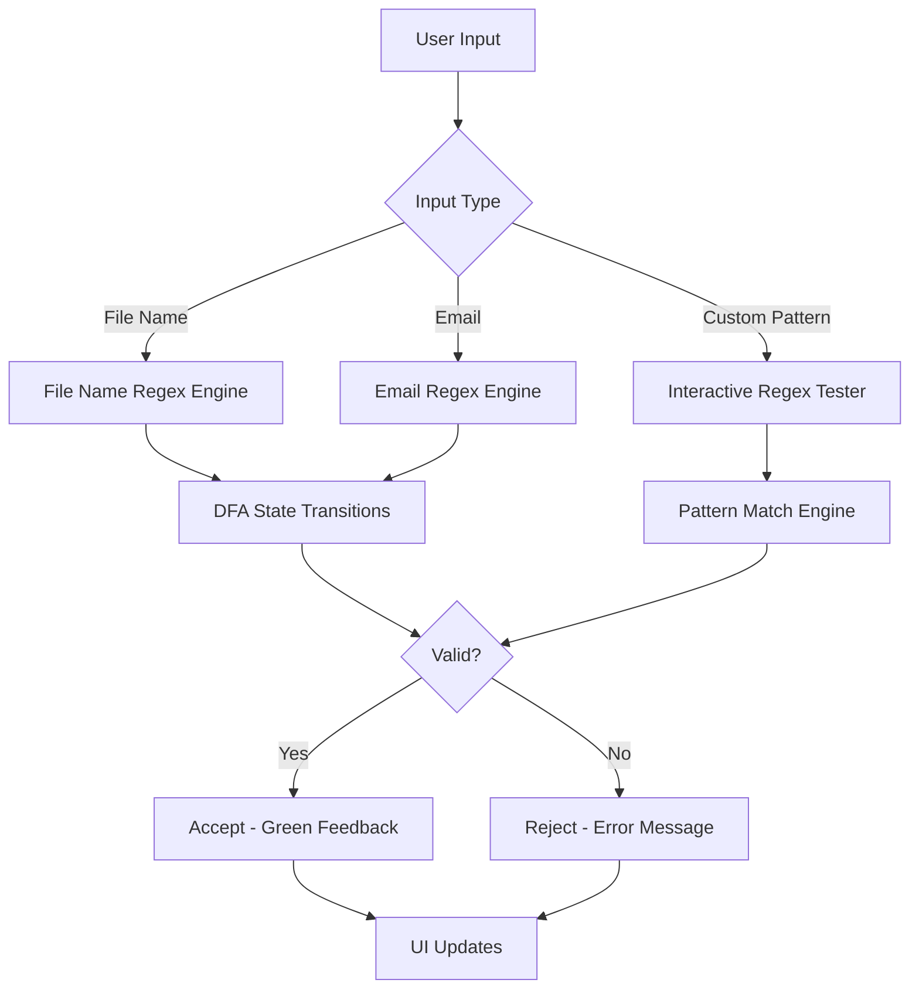
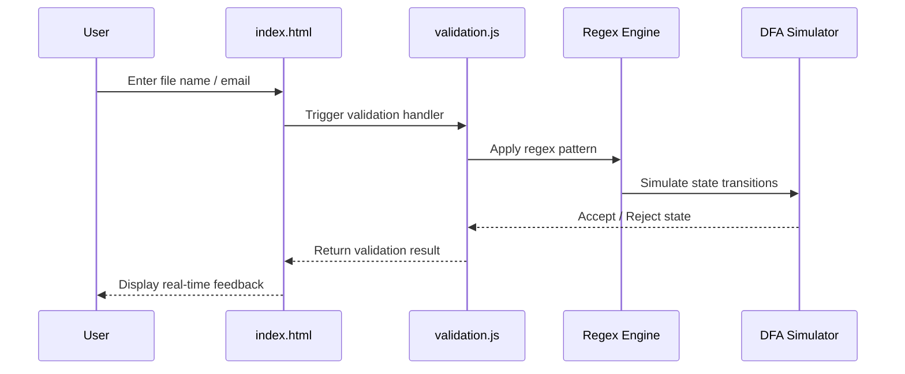

# Secure File Upload Validation System

> **A production-quality, web-based validation engine** that implements Regular Expressions (Regex), Deterministic Finite Automata (DFA), and Non-Deterministic Finite Automata (NFA) concepts from Theory of Computation (TOC) to perform secure client-side file upload and email validation.

[](https://tushar-toc-regex.netlify.app/)
[](https://github.com/tusharkkp/regex/stargazers)
[](https://github.com/tusharkkp/regex/network/members)
[](LICENSE)
[](https://developer.mozilla.org/en-US/docs/Web/HTML)
[](https://developer.mozilla.org/en-US/docs/Web/CSS)
[](https://developer.mozilla.org/en-US/docs/Web/JavaScript)
[](https://tushar-toc-regex.netlify.app/)

---

## Table of Contents

- [Problem Statement](#-problem-statement)
- [Live Demo](#-live-demo)
- [Features](#-features)
- [Architecture & Workflow](#-architecture--workflow)
- [TOC Concepts Implemented](#-toc-concepts-implemented)
- [Tech Stack](#-tech-stack)
- [Project Structure](#-project-structure)
- [Installation & Setup](#-installation--setup)
- [Usage Guide](#-usage-guide)
- [API / Validation Patterns](#-api--validation-patterns)
- [Screenshots](#-screenshots)
- [Performance & Scalability](#-performance--scalability)
- [Future Scope](#-future-scope)
- [Contributing](#-contributing)
- [License](#-license)
- [Author](#-author)

---

## Problem Statement

Web applications face persistent security risks from **unvalidated file uploads and malformed email inputs**. Common vulnerabilities include:

- Uploading files with dangerous extensions (`.exe`, `.sh`, `.php`) disguised as safe files
- Accepting malformed email addresses that bypass weak validation
- Over-reliance on server-side validation, creating latency and exposing attack surfaces
- Lack of real-time feedback frustrating end users

This project solves these issues using **mathematically rigorous** validation powered by Regular Expressions and Finite Automata — the same foundational concepts used in compilers, search engines, and lexical analyzers.

---

## Live Demo

| Resource | Link |
|----------|------|
| Live Application | [tushar-toc-regex.netlify.app](https://tushar-toc-regex.netlify.app/) |
| GitHub Repository | [github.com/tusharkkp/regex](https://github.com/tusharkkp/regex) |
| Interactive Regex Tester | Available inside the app |

---

## Features

### Core Validation Features
- **File Name Validation** — Validates naming conventions for `.jpg`, `.png`, `.pdf`, `.docx`, `.mp4`, and more using regex patterns
- **Email Address Validation** — Enforces RFC-compliant email formatting (`user@domain.com`)
- **Interactive Regex Tester** — Users can input custom patterns and test strings in real-time
- **DFA/NFA State Diagram Visualization** — Visual representation of finite automata transitions

### Technical Features
- **Real-Time Validation Feedback** — Instant visual cues on input
- **Fully Responsive Modern UI** — Mobile-first design with clean CSS
- **Zero Dependencies** — Pure HTML5 + CSS3 + Vanilla JavaScript
- **Offline Capable** — Runs entirely in the browser without server calls
- **Theory Documentation** — In-app explanations of TOC concepts
- **Comprehensive Test Cases** — Documented in `Test_Report.pdf`

---

## Architecture & Workflow



### Data Flow



---

## TOC Concepts Implemented

| Concept | Description | Implementation |
|---------|-------------|----------------|
| **Regular Expressions** | Formal language patterns over finite alphabet | `validation.js` regex patterns |
| **Deterministic Finite Automaton (DFA)** | Single next-state per input symbol | File extension validation |
| **Non-Deterministic Finite Automaton (NFA)** | Multiple possible states per input | Email format validation |
| **Kleene's Theorem** | Every regex corresponds to a DFA | Foundation of all patterns |
| **Regular Languages** | Languages accepted by finite automata | All validated input classes |
| **Pattern Recognition** | Identifying valid strings in a language | Real-time form feedback |
| **Lexical Analysis** | Tokenizing and validating structured input | File name component parsing |

---

## Tech Stack

### Frontend
| Technology | Purpose |
|------------|---------|
| **HTML5** | Semantic structure, form elements |
| **CSS3** | Modern UI, animations, responsive layout |
| **Vanilla JavaScript (ES6+)** | Validation logic, DOM manipulation |

### Algorithms / Theory
| Concept | Role |
|---------|------|
| **Regular Expressions** | Core pattern matching engine |
| **DFA Simulation** | Deterministic state-based validation |
| **NFA Simulation** | Non-deterministic pattern coverage |

### Deployment
| Platform | Usage |
|----------|-------|
| **Netlify** | Static site hosting with CI/CD |

---

## Project Structure

```
regex/
├── index.html              # Main application (HTML + CSS + JS bundled)
├── validation.js           # Core regex & finite automata validation logic
├── Group_Report.pdf        # Full project report (TOC mini project)
├── Test_Report.pdf         # Comprehensive test cases & results
├── Theory_Supplement.pdf   # TOC theory: DFA, NFA, Regular Languages
├── Please_readme.md        # Original draft notes
├── README.md               # This file
LICENSE                     # MIT License
CONTRIBUTING.md             # Contribution guidelines
CHANGELOG.md                # Version history
CODE_OF_CONDUCT.md          # Community standards
SECURITY.md                 # Security policy
```

---

## Installation & Setup

### Prerequisites
- Any modern web browser (Chrome, Firefox, Edge, Safari)
- No additional dependencies required

### Method 1: Direct Browser (Recommended)

```bash
# Clone the repository
git clone https://github.com/tusharkkp/regex.git

# Navigate into the project folder
cd regex

# Open in browser
open index.html   # macOS
start index.html  # Windows
xdg-open index.html  # Linux
```

### Method 2: VS Code Live Server

```bash
# 1. Install VS Code Live Server extension
# 2. Open the project folder in VS Code
# 3. Right-click index.html > Open with Live Server
# 4. App auto-opens at http://127.0.0.1:5500
```

### Method 3: Python Simple Server

```bash
# Python 3
python -m http.server 8000
# Visit: http://localhost:8000
```

---

## Usage Guide

### 1. File Name Validation
- Navigate to the **File Validation** section
- Enter a file name (e.g., `report_2025.pdf`, `profile-image.jpg`)
- The validator checks:
  - Allowed characters in the filename stem
  - Correct file extension format
  - Extension membership in the allowed list
- Receive instant **Accept** (green) or **Reject** (red) feedback

### 2. Email Validation
- Navigate to the **Email Validation** section
- Enter an email address (e.g., `tushar@gmail.com`)
- The validator checks:
  - Local part format (alphanumeric, dots, underscores, hyphens)
  - Presence of `@` symbol
  - Domain name validity
  - TLD format (e.g., `.com`, `.org`, `.in`)

### 3. Interactive Regex Tester
- Enter any custom **regex pattern**
- Enter a **test string**
- See real-time match results with highlighted groups
- Useful for learning and experimenting with regex syntax

---

## API / Validation Patterns

All patterns are defined in `validation.js`. Key regex patterns:

| Pattern Type | Regex | Matches |
|---|---|---|
| **JPEG/JPG File** | `/^[a-zA-Z0-9_\-\s]+\.jpe?g$/i` | `image.jpg`, `photo.jpeg` |
| **PDF File** | `/^[a-zA-Z0-9_\-\s]+\.pdf$/i` | `report.pdf`, `doc_v2.pdf` |
| **PNG File** | `/^[a-zA-Z0-9_\-\s]+\.png$/i` | `logo.png`, `banner.png` |
| **DOCX File** | `/^[a-zA-Z0-9_\-\s]+\.docx$/i` | `thesis.docx`, `notes.docx` |
| **Email** | `/^[a-zA-Z0-9._%+\-]+@[a-zA-Z0-9.\-]+\.[a-zA-Z]{2,}$/` | `user@domain.com` |

---

## Performance & Scalability

- **Zero latency** — All validation runs client-side; no network round-trips
- **Lightweight** — No external libraries; total JavaScript under 65 KB
- **Extensible patterns** — New file types can be added by extending `validation.js`
- **Modular architecture** — Validation logic is completely decoupled from the UI
- **Cross-browser compatible** — Uses standard ES6+ APIs supported by all modern browsers

---

## Future Scope

- [ ] **Backend Integration** — Add server-side validation layer with Node.js/Express
- [ ] **File MIME Type Sniffing** — Validate actual file content, not just extension
- [ ] **Advanced DFA Visualizer** — Interactive, animated state-machine diagram
- [ ] **More File Types** — Support for `.mp3`, `.mp4`, `.zip`, `.csv`, `.xlsx`
- [ ] **Regex Library** — Curated, reusable regex patterns for common use-cases
- [ ] **i18n Support** — Internationalized error messages
- [ ] **Unit Test Suite** — Automated tests with Jest
- [ ] **Browser Extension** — Validate forms on any webpage

---

## Contributing

Contributions are welcome! Please read [CONTRIBUTING.md](CONTRIBUTING.md) before submitting a PR.

```bash
# 1. Fork the repository
# 2. Create your feature branch
git checkout -b feature/your-feature-name

# 3. Commit your changes
git commit -m 'feat: add email domain blacklist validation'

# 4. Push to your branch
git push origin feature/your-feature-name

# 5. Open a Pull Request
```

---

## License

This project is licensed under the **MIT License** — see the [LICENSE](LICENSE) file for details.

---

## Author

**Tushar Kaldate**

- GitHub: [@tusharkkp](https://github.com/tusharkkp)
- LinkedIn: [tushar-kaldate-2b5276262](https://www.linkedin.com/in/tushar-kaldate-2b5276262/)
- Project: [Secure File Upload Validation System](https://tushar-toc-regex.netlify.app/)

---

## Acknowledgement

Developed as part of the **Theory of Computation (TOC)** coursework (Course Code: 2304220T) to demonstrate practical implementation of Regular Expressions, Deterministic Finite Automata, and Non-Deterministic Finite Automata in real-world web-based validation systems.

---

<div align="center">

**If this project helped you, please consider giving it a star!**

[](https://github.com/tusharkkp/regex)

</div>
